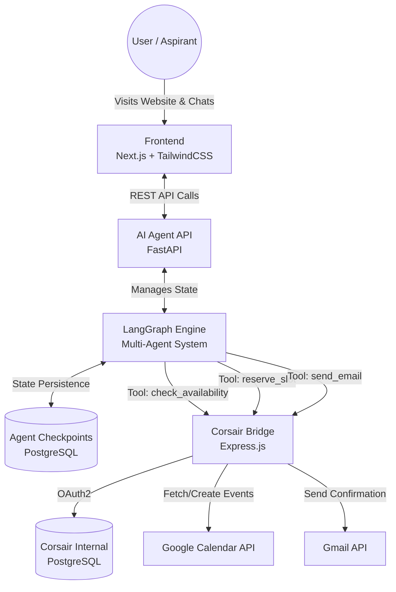

# Lakshya Scheduling Platform

Lakshya Scheduling Platform is an AI-powered mentorship booking system designed for Lakshya IAS Academy. It leverages a modern microservices architecture to provide aspirants with a seamless experience when booking counseling sessions, mock interviews, and mentorship calls via an intelligent conversational agent.

## System Architecture

The platform is divided into three distinct services working in tandem:

1. **Frontend (`/frontend`)**: A Next.js web application providing the user interface, chat experience, and dashboard.
2. **AI Agent (`/python-agent`)**: A Python-based LangGraph multi-agent system exposing an API to handle intent classification, slot availability checking, and booking operations.
3. **Corsair Bridge (`/corsair-bridge`)**: An Express.js microservice utilizing the Corsair framework to safely connect with Google Workspace APIs (Calendar & Gmail) for finalizing bookings and sending confirmations.

### Global Architecture Diagram

## Service Overview

### 1. Frontend Web App
Located in `/frontend`. This is the user-facing application built with Next.js App Router and TailwindCSS. It provides the landing page, the conversational chat UI, and the user's booking dashboard.
* **Tech Stack**: Next.js 14, React, TailwindCSS, GSAP (for animations), NextAuth.js.
* [Read more in frontend/README.md](./frontend/README.md)

### 2. Python AI Agent
Located in `/python-agent`. This service powers the intelligent assistant named "Arjun". It uses LangGraph to orchestrate multiple AI agents (e.g., Triage Agent, Booking Specialist) that process user requests, extract intents, and call external tools to fulfill bookings.
* **Tech Stack**: FastAPI, LangChain, LangGraph, PostgreSQL (Checkpoints), OpenAI / Cerebras.
* [Read more in python-agent/README.md](./python-agent/README.md)

### 3. Corsair Bridge
Located in `/corsair-bridge`. This service acts as the secure middleman between the AI agent and third-party APIs like Google Calendar and Gmail. It abstracts the complexity of OAuth flows and API integrations into simple REST endpoints that the Python agent can invoke as tools.
* **Tech Stack**: Express.js, TypeScript, Corsair SDK, Zod, PostgreSQL.
* [Read more in corsair-bridge/README.md](./corsair-bridge/README.md)

## Data Flow & Lifecycle

1. **Initiation**: The user starts a chat on the frontend. The chat UI sends the user's messages to the Next.js API route (`/api/chat`), which proxies them to the Python Agent's `/chat` endpoint.
2. **Triage**: In LangGraph, the *Triage Agent* classifies the user's intent. If it's a general query, it handles it. If the user wants to book a session, it routes to the *Booking Specialist*.
3. **Execution**: The *Booking Specialist* collects necessary info (Date, Time, Email) and uses tools to invoke the Corsair Bridge.
4. **Integration**: The Corsair Bridge safely executes actions on Google Calendar and sends MIME-formatted emails via Gmail, returning success status to the Agent.
5. **Confirmation**: The Agent informs the user that the session is booked, and the Frontend updates its UI to show a "Confirmed" status.

---

*Designed for seamless scale and reliability using agentic workflows.*
