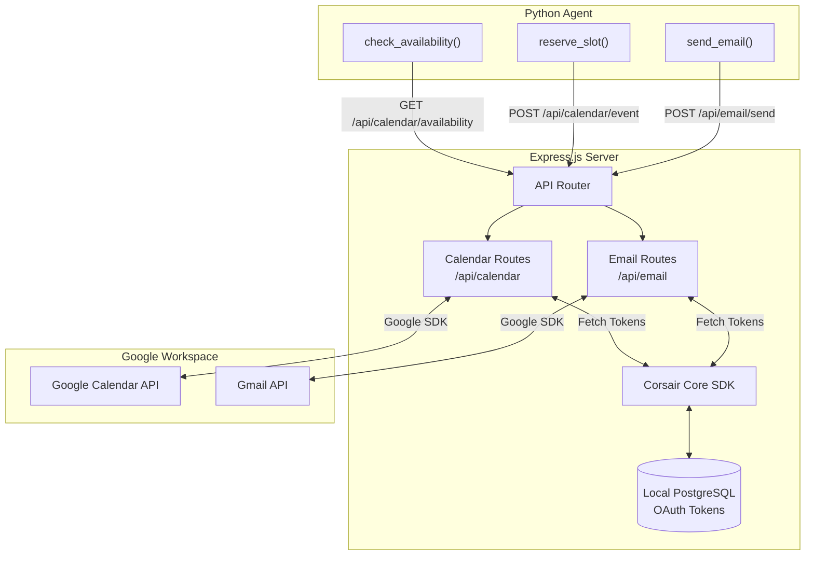

# Corsair Bridge Microservice

This directory contains the integration layer for the Lakshya Scheduling Platform. It uses Express.js and the Corsair framework to safely manage OAuth2 credentials and execute actions against third-party Google Workspace APIs.

## Architecture & Data Flow

The Python agent lacks direct access to the user's Google Workspace. Instead, it relies on this microservice to perform calendar lookups, event creation, and email dispatch securely. 



## Key Components

- **`src/index.ts`**: Express server setup, CORS configuration, and route registration.
- **`src/corsair.ts`**: Initialization of the Corsair SDK. It handles the PostgreSQL connection and loads the required integration plugins (`@corsair-dev/googlecalendar`, `@corsair-dev/gmail`).
- **`src/routes/calendar.ts`**: Endpoints for parsing requested dates, querying the Google Calendar API for free/busy slots, and creating new calendar events.
- **`src/routes/email.ts`**: Endpoints for sending confirmation emails via the Gmail API.
- **`src/utils/mime.ts`**: Contains the logic to build multipart MIME HTML email templates, matching the Lakshya IAS minimalist monochrome aesthetic.

## Why Corsair?

Managing OAuth flows (Access Tokens, Refresh Tokens, Expirations, Consent Screens) for server-to-server Google API communication is notoriously complex. The Corsair framework abstracts this into a simple CLI setup and provides an SDK that automatically handles token refresh and authentication headers, allowing us to focus solely on the business logic of scheduling.

## Getting Started

1. Install dependencies:
   ```bash
   pnpm install
   ```
2. Configure `.env`:
   Provide your `DATABASE_URL` for Corsair to store tokens.
3. Authenticate Integrations:
   Run the Corsair CLI to authenticate your Google Account.
   ```bash
   pnpm run setup:gmail
   pnpm run setup:calendar
   ```
4. Start the server:
   ```bash
   pnpm run dev
   ```
