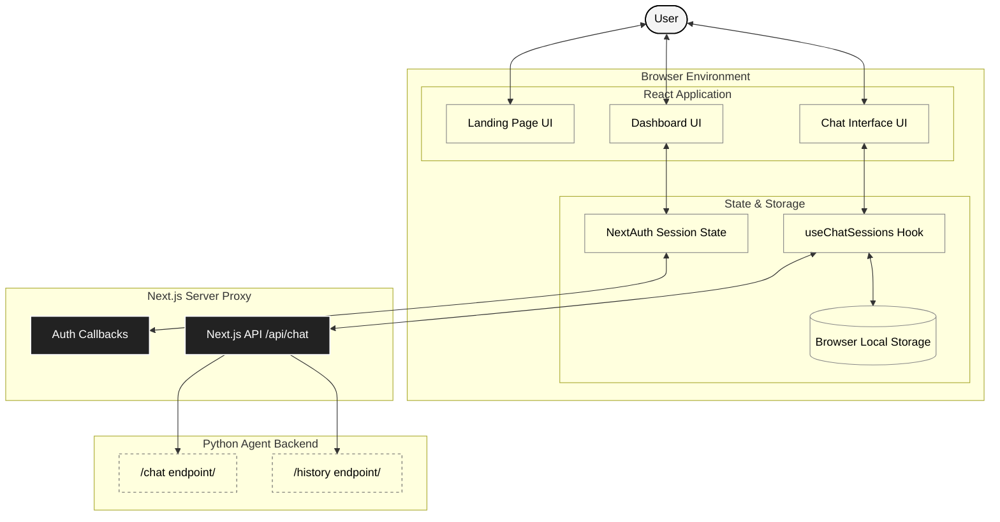

<div align="center">
  <h1>✨ Lakshya Frontend</h1>
  <p><em>The polished, conversational user interface for the scheduling platform.</em></p>
  
  [](#)
  [](#)
  [](#)
  [](#)
</div>

---

## 📐 Architecture & Data Flow

The frontend is a strictly typed SPA (Single Page Application) built with Next.js App Router. It acts as the presentation layer, handling state management, animations, and secure proxying to the AI agent.



## 🛠️ Key Components

- **`Hero.tsx` & `SessionTypes.tsx`**: Landing page components featuring GSAP animations and a minimalist monochrome aesthetic.
- **`ChatWindow.tsx` & `MessageBubble.tsx`**: The core conversational interface. Handles optimistic message updates, typing indicators, and parses Markdown from the AI responses.
- **`useChatSessions.ts`**: A custom React hook that manages chat threads using browser local storage, explicitly preventing the storage of abandoned, empty chat threads.
- **Next.js API Routes (`/api/chat/route.ts`)**: Acts as a proxy to the Python backend to prevent exposing the agent's internal URL to the public browser.

## 🎨 Theming & Styling

The application adheres to a strict **Corsair Monochrome** design system:
- **Colors**: Primarily `#1c1c1c` (Black/Dark Gray), `#f4f4f4` (Light Gray), `#fafafa` (Off-white), and `#ebebeb` (Borders).
- **Typography**: Inter font with tight tracking for headings.
- **Animations**: Subtle, hardware-accelerated animations using GSAP (GreenSock) for entrance, hover states, and smooth scrolling.

## Getting Started

1. Install dependencies:
   ```bash
   npm install
   ```
2. Set up environment variables (`.env.local`):
   ```
   NEXT_PUBLIC_API_URL=http://localhost:8000
   NEXTAUTH_SECRET=your_secret
   ```
3. Run the development server:
   ```bash
   npm run dev
   ```

The application will be available at `http://localhost:3000`.
