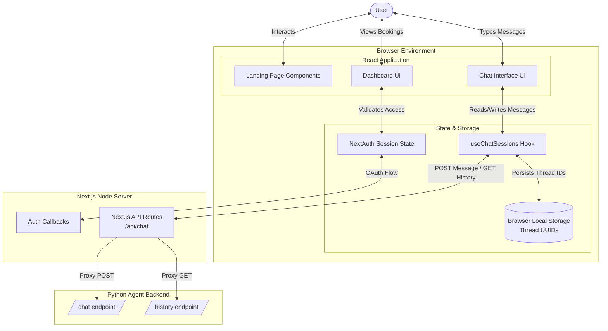

# Lakshya Frontend Web App

This directory contains the user-facing Next.js application for the Lakshya Scheduling Platform. It provides a polished, interactive chat interface where users can talk to "Arjun" (the AI assistant), as well as a dashboard to view their booked mentorship sessions.

## Architecture & Data Flow

The frontend is built as a Single Page Application (SPA) using the Next.js App Router. It is responsible for maintaining the user's conversational state, handling UI animations, and communicating securely with the AI agent.



## Key Components

- **`Hero.tsx` & `SessionTypes.tsx`**: Landing page components featuring GSAP animations and a minimalist monochrome aesthetic.
- **`ChatWindow.tsx` & `MessageBubble.tsx`**: The core conversational interface. Handles optimistic message updates, typing indicators, and parses Markdown from the AI responses.
- **`useChatSessions.ts`**: A custom React hook that manages chat threads using browser local storage, explicitly preventing the storage of abandoned, empty chat threads.
- **Next.js API Routes (`/api/chat/route.ts`)**: Acts as a proxy to the Python backend to prevent exposing the agent's internal URL to the public browser, whilst also handling error states (e.g., rate limiting).

## Theming & Styling

The application adheres to a strict "Corsair Monochrome" design system:
- **Colors**: Primarily `#1c1c1c` (Black/Dark Gray), `#f4f4f4` (Light Gray), `#fafafa` (Off-white), and `#ebebeb` (Borders).
- **Typography**: Inter font with tight tracking for headings.
- **Animations**: Subtle, hardware-accelerated animations using GSAP (GreenSock) for entrance, hover states, and smooth scrolling.

## Getting Started

1. Install dependencies:
   ```bash
   npm install
   ```
2. Set up environment variables (`.env.local`):
   ```
   NEXT_PUBLIC_API_URL=http://localhost:8000
   NEXTAUTH_SECRET=your_secret
   ```
3. Run the development server:
   ```bash
   npm run dev
   ```

The application will be available at `http://localhost:3000`.
