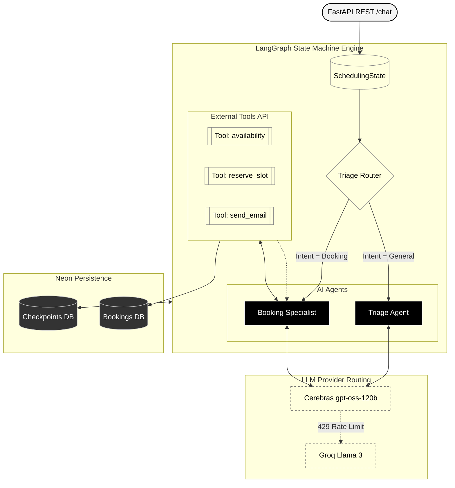

<div align="center">
  <h1>🧠 Lakshya Python Agent</h1>
  <p><em>The cognitive LangGraph engine orchestrating bookings and user triage.</em></p>
  
  [](#)
  [](#)
  [](#)
</div>

---

## 📐 Architecture & Data Flow

The agent utilizes LangGraph to create a deterministic, state-driven execution flow. Instead of a single LLM trying to do everything, tasks are delegated to specialized agents (nodes) which can use external tools.



## 🛠️ Key Components

- **`main.py`**: The entry point. Sets up the FastAPI server, defines API routes (`/chat`, `/chat/history`), and initializes the graph.
- **`agents/graph.py`**: The LangGraph definition. Wires up the Triage Agent, Booking Specialist, and the Conditional Router. Initializes the PostgreSQL checkpointer.
- **`agents/triage_agent.py`**: The primary classifier. Evaluates if the user is asking a general question or wants to book a session.
- **`agents/booking_specialist.py`**: A specialized agent with access to tools. Guides the user through collecting their name, email, preferred session type, and date/time.
- **`tools/*.py`**: Functions bound to the Booking Specialist that make HTTP requests to the `corsair-bridge` to perform real-world actions.

## 🤖 LLM Strategy & Fallbacks

The system implements a robust LLM routing strategy to handle rate limits and API failures:
- **Primary Model**: Cerebras-hosted Llama models for ultra-fast, low-latency inference.
- **Fallback Chain**: Uses secondary Cerebras keys, Groq APIs, and fallback models (e.g., Mixtral) automatically if the primary endpoint throws a 429 Rate Limit error.

## Getting Started

1. Install dependencies:
   ```bash
   pip install -r requirements.txt
   ```
2. Configure `.env`:
   Provide API keys for OpenAI/Cerebras, Groq, and the PostgreSQL connection string.
3. Run the server:
   ```bash
   uvicorn main:app --reload --port 8000
   ```
